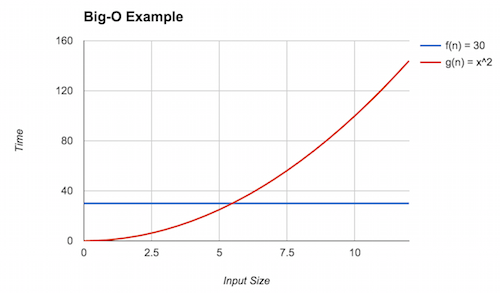

# Asymptotic Analysis

So far we built up intuition about what it means to perform complexity analysis and learned how to model the number relevant operations a program performs using mathematical functions.
However, as mentioned previously, computers are fast enough that on small inputs, virtually any set of algorithms that solve the same problem will perform identically.
Rather than worry about small inputs, we would like to understand how our program behavior _scales_ when it is given larger inputs.
The study of this scaling behavior is called the _asymptotic analysis of algorithms_, and the main tool we use to express this behavior is _Big-O notation_.
In this section we'll study this mathematical formalism and tie it back to the informal reasoning we will need to perform on a day-to-day basis.

## Growth of Functions

We model the complexity of computer programs using mathematical functions.
And we can categorize the different mathematical functions in terms of how their outputs grow relative to their inputs.

+   **Constant Functions** are those functions that do not depend on their input.
    For example $f(x) = 300$ is a constant function that evaluates to $300$, irrespective of its input.
    A function that swaps two indices of an array always writes twice to an array no matter what the length of the array is or what indices are given.
    
    ~~~java
    public static void swap(int[] arr, int i, int j) {
        int tmp = arr[i];
        arr[i] = arr[j];
        arr[j] = tmp;
    }
    ~~~

+   **Linear Functions** take the form $f(x) = mx + b$ where $m$ and $b$ are constants.
    They correspond to lines.
    For example, walking an array, e.g., to find a given element, takes linear time.

    ~~~java
    public static boolean contains(int [] arr, int k) {
        for (int i = 0; i < arr.length; i++) {
            if (arr[i] == k) {
                return true;
            }
        }
        return false;
    }
    ~~~

+   **Quadratic Functions** take the form $f(x) = ax^2 + bx + c$ where $a$, $b$, and $c$ are constants.
    They correspond to curves.
    Functions with quadratic complexity arise, for example, when we must perform an operation involving all possible pairs of a collection of objects.
    For example, consider a function that computes the Cartesian product, i.e., set of all possible pairs, of an array of elements.

    ~~~java
    class Point {
        public int x;
        public int y;
        public Point(int x, int y) {
            this.x = x;
            this.y = y;
        }
    }

    public static Point[] cartesianProduct(int[] arr) {
        Point[] result = new Point[arr.length * arr.length];
        for (int i = 0; i < arr.length; i++) {
            for (int j = 0; j < arr.length; j++) {
                result[arr.length * i + j] = new Point(arr[i], arr[j]);
            }
        }
        return result;
    }
    ~~~
    
    If there are $n$ objects, then there are $n \times n = n^2$ operations that must be performed.

+   **Cubic Functions** take the form $f(x) = ax^3 + bx^2 + cx + d$ where $a$, $b$, $c$, and $d$.
    They correspond to curves with an inflection point and have a slope greater than a quadratic function.
    Functions with cubic complexity arise, for example, when we must perform an operation involving all possible triples of a collection of objects.
    You can imagine generalizing the Cartesian product code above to produce all _three-dimensional_ points drawn from an input array.
    Like the quadratic case, if there are $n$ objects, then there are $n \times n \times n = n^3$ operations to be performed.

+   **Polynomial Functions** generalizes all the previous functions discussed so far!
    A polynomial has the form $f(x) = \sum_{i} a_i x^i + c$ where each $a_i$ and $c$ are constants.
    In practice, we'll distinguish between constant time ($i = 0$), linear time ($i = 1$), and polynomial time ($i \geq 2$) functions.

+   **Exponential Functions** take the form $f(x) = ab^x$ where $a$ and $b$ are constants.
    They correspond to curves but with a steeper slope than any polynomial function.
    Exponential functions arise, for example, when we have to consider all possible subsets of a collection of objects.
    For a collection of $n$ objects, there are $2^n$ possible such subsets.

    A common "exponential" we'll encounter in computer programming is the factorial function, $f(x) = x!$.
    $x!$ corresponds to the number of possible orderings or _permutations_ of $x$ elements.
    By Stiring's approximation:

    $$
      n! ~ \sqrt{2 \pi n} (\frac{n}{e})^{n}
    $$

    This term's growth is dominated by the $(\frac{n}{e})^n$ term which is exponential.

+   **Logarithmic Functions** take the form $f(x) = \log x$.
    When using $\log$ we usually assume the base of the logarithm is 10 (so that $\log{10^3} = 3$).
    However, in computer science, we usually assume $\log$ is base 2.
    It turns out the base of the logarithm is usually irrelevant for our purposes of asymptotic analysis because via the change-of-base rule:
    
    $$
    \log_a x = \frac{\log_b x}{\log_a b}
    $$
    
    Logarithms of different bases only differ by a constant amount (the term $\log_a b$ in the denominator of the fraction).

    Logarithmic functions arise when we are able to divide a problem into sub-problems whose size is reduced by some factor, e.g., by half.
    When these problems are smaller versions the original problem, we call them "divide-and-conquer" problems and frequently use recursive design to solve them.
    The canonical logarithmic function is _binary search_ where, instead of removing one element from consideration on every iteration, we remove half of the elements of the (sub-)array we are examining.

+   **Linearithmic Functions** are "linear-like" functions multiplied by some logarithmic factor, i.e., have the form $f(x) = x \log x$.
    Linearithmic functions arise when a divide-and-conquer sub-problems requires a linear amount of work.
    For example, the most efficient general-purpose sorting algorithms have this runtime.

## Big-O Notation

When we perform complexity analysis, we would like to classify the growth behavior of our program according to one of the classes of functions listed above.
We use _Big-O_ notation to capture this fact.
When we write $\mathcal{O}(f)$ for some function $f$, we refer to the set of functions that are all in the same growth class as $f$.
For example, $\mathcal{O}(f)$ where $f(n) = n$, refers to the class of linear functions such as:

$$
\begin{align*}
f_1(n) &= 3n \\
f_2(n) &= 5n - 3 \\
f_3(n) &= 1 - n
\end{align*}
$$

If we, therefore, think of $\mathcal{O}(f)$ as a set of functions, we can write $g \in \mathcal{O}(f)$ to mean that function $g$ belongs to the same class of functions that $f$ belongs to (i.e., the class denoted by $\mathcal{O}(f)$.
The functions $f, f_1, f_2, f_3$ above are all in the same complexity class so $f ∈ \mathcal{O}(f_1)$, $f_1 ∈ \mathcal{O}(f)$, $f \in \mathcal{O}(f_2)$, $f_2 ∈ \mathcal{O}(f_1)$, etc.

We can categorize the complexity of our functions by using big-O notation in tandem with the mathematical models we build to count the functions' relevant operations.
For example:

+   The number of array operations performed by the `swap` method is $T(n) = 2$ where $n$ is the size of the input array.
    We can say that $T \in \mathcal{O}(1)$, declaring that the runtime of \ji{swap} is in the constant complexity class.
+   The number of array operations performed by the `sum` method is $T(n) = n$ where $n$ is the size of the input array.
    We can say that $T \in \mathcal{O}(n)$, declaring that the runtime of \ji{sum} is in the linear complexity class.

Note that when describing the complexity class in practice, we:

1.  Rather than saying $\mathcal{O}(f)$ where $f(n) = \ldots$ which is overly verbose, we simply inline the body of the complexity class function with the $\mathcal{O}(\cdot)$ notation.
    For example, we write $\mathcal{O}(1)$ instead of $\mathcal{O}(f)$ where $f(n) =  1$.
1.  Use the simplest function in that class, e.g., $n$ instead of $2n$ or $3n + 5$.
    While using more complicated classes is technically accurate, such usage loses sight of the fact that we are referring to the class of functions that are linear rather than a particular such function.
    In particular, with the constant complexity class we always write $\mathcal{O}(1)$ since it relates together all constant functions together.

## The Formal Definition of Big-O

So far, we've developed an informal idea of Big-O—a classification of the growth rate of mathematical functions.
Now let's unveil the specifics.
The formal definition of Big-O is:

$$
f \in \mathcal{O}(g) \Leftrightarrow \exists c > 0, n_0 \ldotp \forall n \geq n_0 \ldotp |f(n)| \leq c|g(n)|
$$

What does this mean?
First of all, for some function of interest $f$, we say that $f \in \mathcal{O}(g)$, pronounced "$f$ is oh-of-$g$" or "$f$ is order $g$".
This is true whenever there exists ($\exists$) two constants $c$ and $n_0$ such that for all ($\forall$) $n$ where $n \geq n_0$ the following inequality holds: $|f(n) \leq c|g(n)|$.
That is $g(n)$ dominates $f(n)$ by some constant factor $c$ after some starting input $n_0$.

$f \in \mathcal{O}(g)$ captures the idea that $f$ is _bounded above_ by $g$.
To prove this fact about a particular $f$ and $g$, we must provide the two integers demanded by the existential:

+   $c$, a constant factor that $g$ is multiplied by and
+   $n_0$, the minimum input size to consider.

Such that for all input sizes greater than or equal to $n_0$, $f(n)$ is less than or equal to $cg(n)$.
That is, from $n_0$ on, $f$ is also smaller (or equal) to $g$ within a constant.

For example, let's show that $f \in \mathcal{O}(g)$ where $f(n) = 30$ and $g(n) = n^2$.
First let's examine a graph of the two functions:



We can see that eventually $g$ (the red line) dominates $f$ (the blue line), but what is that point?
This is the point where $g(n) = n^2 = 30$.
Solving for $n$ yields $n = 30^{1/2} \approx 5.48$.
Thus, we can claim that $n_0 = 6$ (rounding up to be safe) and $c = 1$.
Here, we see the inequality holds because $f(6) = 30 \leq g(6) = 36$.
With this, we can conclude that $f \in \mathcal{O}(g)$.

Big-O provides an _upper bound_ on the asymptotic complexity of a function.
For example, in the above example $f \in \mathcal{O}(n!)$ as well.
To see this, note that for $n \geq 5$, $f(n) \leq g(n)$.
However, this is a _weak_ upper bound because many other classes of functions are "smaller" than factorial, for example, polynomials and linear functions.

We always want to provide the _tightest_ bound possible.
Because we are not analyzing pure mathematical functions but, instead, computer programs with arbitrary behavior, it will sometimes be impractical, infeasible, or impossible to give a precise model and, thus, tight bound.
We will therefore resort to a less tight bound in these situations.
For example, you may suspect that the program has quadratic complexity ($n^2$) but have difficulty proving it, so instead, you may claim a cubic bound ($n^3$) instead which may be easier to show.

### A Note on Notation

In our presentation of Big-O, we have been consistent in interpreting $\mathcal{O}(f)$ as a _set of functions_ in the same complexity class as $f$.
$f$ in this situation serves as the _representative function_ for that complexity class and some other function \\
We then say some other function $g$ is also in this class with set inclusion ($\in$) notation.

While this notation is consistent with the set-theoretic interpretation of Big-O that we present, it is not the traditional way that we write Big-O!
Instead, Big-O traditionally written with equality: 

$$
f(x) = \mathcal{O}(g(x))
$$

The traditional equality notation here obscures the idea that $\mathcal{O}(g(x))$ really denotes a set!
We'll continue to use set notation throughout this text.
However, be aware that in other presentation of Big-O, you'll see equality notation which means the same thing!

## Additional Asymptotic Bounds

Big-O notation gives us a way of describing the behavior of a function as its input grows.
In mathematics, we formally define this as taking the limit of the function (typically to infinity).
Thus, our techniques above are an example of _asymptotic analysis_ where we analyze the limiting behavior of mathematical functions.

The definition of Big-O described previously has many parts to it.
By changing this definition we obtain other useful notations for describing the asymptotic behavior of functions.
For example, consider flipping the inequality relating $f$ and $g$.
We obtain the following definition:

$$
f \in \Omega(g) \Leftrightarrow \exists c > 0, n_0 \ldotp \forall n \geq n_0 \ldotp |f(n)| \geq c|g(n)|
$$

When it is $f$ that dominates $g$, we write $f \in \Omega(g)$ (pronounced "$f$ is big-omega of $g$").
Intuitively, this definition states that $g$ is a _lower bound_ of $f$.
In the context of computational complexity, this means that the algorithm corresponding to $f$ performs no better than the algorithm corresponding to $g$.
For example, it is known that any comparison-based sorting algorithm is $\Omega (n \log n)$, i.e., no such algorithm can perform better than $\mathcal{O}(n \log n)$.

If $g$ serves both as an upper- and lower-bound for $f$, we write $f \in \Theta(g)$ (pronounced "$f$ is big-theta of $g$").

$$
f \in \Theta(g) \Leftrightarrow \exists c_1, c_2 > 0, n_0 \ldotp \forall n \geq n_0 \ldotp c_1|g(n)| \leq |f(n)| \leq c_2|g(n)|
$$

Here, $g$ describes _exactly_ the family of functions in which $f$ resides.
Often we would like to characterize our models with big-theta bounds.
However, it is frequently onerous, difficult, or both to prove that $g$ is a lower bound, let alone an upper bound, so we frequently stick with big-O bounds instead of big-theta.

Finally, note in the statements above that we posit that _there exists_ a constant that inflates $g$ appropriately.
This implies that there may exist some constants where the desired inequality—less than for big-O and greater than for big-omega—does not hold.
We can make a stronger claim by asserting that the inequality holds _for all_ constants rather than at least one:

$$
\begin{gather*}
f \in o(g)      \Leftrightarrow \forall c > 0 \ldotp \exists n_0 \ldotp \forall n \geq n_0 \ldotp |f(n)| \leq c|g(n)| \\
f \in \omega(g) \Leftrightarrow \forall c > 0 \ldotp \exists n_0 \ldotp \forall n \geq n_0 \ldotp |f(n)| \geq c|g(n)|
\end{gather*}
$$

These "little" versions of big-O and big-omega ("little-o" and "little-omega", respectively) make a strictly stronger claim than their big counterparts by asserting that the desired inequality holds, irrespective of the chosen constant.
In practice, this means that $f$ and $g$ are in strictly different families of functions.

~~~admonish question title="Big-O Practice (‡)"
Recall that you gave best, worst, and average case mathematical models of the `max` method in a previous reading:

```java
public static int max(int[] arr) {
    if (arr.length == 0) {
        throw new IllegalArgumentException();   // ignore this case
    } else {
        int ret = arr[0];
        for (int i = 1; i < arr.length; i++) {
            if (ret < arr[i]) {
                ret = arr[i];
            }
        }
        return ret;
    }
}
```

Give a big-O bound, the tightest possible bound you can, for each of those models.
~~~