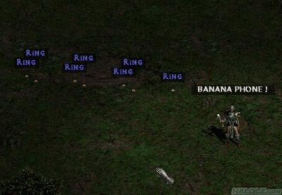

# Loot generator

[Procedural content generation](http://en.wikipedia.org/wiki/Procedural_content) in the context of video games is the process of generating content such as levels, art, or other assets "on the fly" rather than up-front.
For example, instead of designing a series of levels for a game, we may instead provide several *level primitives* and then write a series of rules as to how these primitives can be combined to form actual levels.
Then we can write a series of procedures or methods that automatically combine primitives according to the rules to form complete levels.

Many video games have used procedural content generation to great effect.
One of those games is the venerable Diablo series of which [Diablo IV](http://en.wikipedia.org/wiki/Diablo_IV) released in 2023 is the latest iteration.
Diablo is a [Hack and Slash](http://en.wikipedia.org/wiki/Hack_and_Slash) role-playing game that focuses on leveling up and getting loot for your character by killing monsters.
The appeal of Diablo is that both the levels and loot are procedurally generated so that players are incentivized to replay the game in order to make their characters stronger.
Many games have emulated Diablo procedural design, in particular, the action role-playing game [Torchlight](http://en.wikipedia.org/wiki/Torchlight) and the first-person shooter/role-playing mash-up [Borderlands](http://en.wikipedia.org/wiki/Borderlands_(video_game)).

In this homework, we'll be implementing the loot generation algorithm found in Diablo II.
Since Diablo II has been around for over a decade, dedicated fans have put together exactly how the game procedural generates loot as detailed on the [Diablo Wiki](http://diablo2.diablowiki.net/Item_Generation_Tutorial).
For our purposes, the loot generation algorithm is interesting because the algorithm uses mapping data structures coupled with recursion in a novel way.

The algorithm and data files we use are simplified versions taken from the above article.
However, the core ideas remain the same, so you can have faith that after this assignment, you'll understand how Diablo II generates items!

## Github Repository

* [psosera/loot-generator](https://github.com/psosera/loot-generator)

## The loot generation algorithm

Diablo II uses a collection of files in order to randomly generate loot.
For this homework, we'll be providing you two sets of these files to power your loot generator.
All the files are *tab-delimited* text files, so you can open them up either in VSCode or a spreadsheet program such as Excel or Google Sheets.
In the sections that follow, we'll describe the contents of each of the files, but you should look at these text files yourselves in order to get a sense of the layout.

To generate a single piece of loot, our *LootGenerator* program will go through the following steps:

1.  We *randomly pick* a monster to fight.
    For the purposes of this program, we won't simulate combat; we'll instantly kill the monster!
2.  We *look up the treasure class* of that particular monster and using that treasure class, generate the *base item* that is dropped by the monster.
3.  We generate the *base stats* for the generated base item.
4.  We generate affixes (i.e., prefixes and suffixes) for the item and stat modifiers from those affixes.

### Step 1: Picking the monster

The data file *monstats.txt* contains the list of possible monsters in
the game.
It has the following format:

~~~
Class     Type     Level     TreasureClass
~~~

The class of the monster is its name.
The type and level are irrelevant for our purposes, and the *treasure class* defines the class of items that the monster drops when it dies.
In the next step, we'll look up this treasure class in another file to determine the item the monster drops.

You should choose a random monster from this file to slay using the [`Random` class](https://docs.oracle.com/en/java/javase/23/docs/api/java.base/java/util/Random.html).
Each monster has an equal probability of being chosen.

### Step 2: Looking up the treasure class

Once we've picked a monster and extracted its treasure class (TC), we next go to *TreasureClassEx.txt* to determine the *base item* that the monster drops.
A base item in Diablo II is an armor or weapon type that we'll build upon to generate a final item.
**For this assignment, we will only generate armor pieces.**
Adding weapons is a potential way for you to improve your assignment as outlined below.

*TreasureClassEx.txt* has the following format:

~~~
Treasure Class     Item1     Item2     Item3
~~~

Each treasure class entry in this file describes three possible drops that can occur for that TC.
For example, here is one line of the *TreasureClassEx.txt* from the simple data set.

~~~
Act 5 (H) Equip B     armo60b     armo60b     Act 5 (H) Equip A
~~~
A TC is defined to be a string that has an entry in this file.
So the `Act 5 (H) Equip B` TC has three possible drops which are themselves TCs (because `armo60b` and `Act 5 (H) Equip A` also appear as treasure classes in the file).
Note that `armo60b` appears as two of the three possible drops for `Act 5 (H) Equip B` which means it has 2/3rds of a chance of being picked.
Here is another line from the simple data set:

~~~
armor60a     Embossed Plate     Sun Spirit     Fury Visor
~~~

The `armor60a` TC has three possible drops that are all base items because they _do not_ appear as TCs in the file.

To determine the drop that actually occurs from a monster, we go through the following process.

1. We look up the monster's TC in TreasureClassEx.txt.
2. For that TC, we randomly choose one of three drops listed in the file.
3. If the drop we choose is a TC, we look up that new TC in the file and randomly choose from one of its drops.
   We repeat this process until we finally arrive at a base item.
4. The base item that we finally choose is the randomly generated drop from our monster!

### Step 3: Computing base stats for a base item

Since we are not actually simulating any combat mechanics, computing the base stats for the base item we generated in the previous part simply means we generate a String that contains the *base statistic* for that base item.
For armor pieces, the base statistic is defense and should be printed out in the following form:

~~~
Defense: <defense value>
~~~

The defense value is derived from the entry for the base item in *armor.txt* which has the following form.

~~~
name     minac     maxac
~~~

This defense value for armor is simply a random integer in the range `minac` to `maxac` inclusive.
You will need to generate such a random integer to create the base statistic string.

### Part 4: Generating affixes

Finally, we generate a prefix and suffix for our item.
A prefix and suffix each have a 1/2 chance of being generated.
So our item generator may make an item with both a prefix or suffix, one of a prefix or suffix, or neither a prefix nor a suffix.

Prefixes and suffixes exist in the *MagicPrefix.txt* and *MagicSuffix.txt* files respectively and have the following identical formats:

~~~
Name     mod1code     mod1min     mod1max
~~~

*Name* is precisely the prefix and suffix that you will attach onto the base item's name.
*mod1code* is the additional statistic text that the affix will introduce to the base item.
That statistic will have a single, random integer value in the range *mod1min* and *mod2max* inclusive.

Thus, the format of the final item name will be:

~~~
<prefix (if it exists)> <base item name> <suffix (if it exists)>
~~~

The format of the additional statistics from the prefix and suffix have the form:

~~~
<value> <statistic text>
~~~

Each additional statistic should be printed on a separate line with the prefix statistic coming before the suffix statistic.
If a prefix or suffix is not generated, then you should not include an extra line for that prefix or suffix.

## Format of the output

In your LootGenerator program, you will repeatedly play a number of "rounds" until the user is finished.
Each "round" of the loot generator has you squaring off against a randomly-chosen monster, killing it, and then displaying its loot.
The format of your output for each round should look as follows:

~~~
Fighting <monster name>...
You have slain <monster name>!
<monster name> dropped:

<complete item name>
<base item statistic>
<additional affix statistics>
~~~

Afterwards, you should prompt the user to see if they wish to fight again:

~~~
Fight again [y/n]? <echoed user input from Scanner>
~~~

The prompt should be "generous" in that it is case-insensitive (i.e., "y", "n", "Y", and "N" are all valid responses) and re-prompts the user if they do not enter a valid value.
The re-prompt message is the same as the original prompt message.

## Data sets

The set of files *armor.txt*, *MagicPrefix.txt*, *MagicSuffix.txt*, *monstats.txt*, *TreasureClassEx.txt*, and *weapons.txt* comprise a single data set for your program.
We provide two data sets for testing purposes, found in the `data/` folder of the repository.

*   The *small dataset* consists of a single monster, 6 treasure classes, 9 armor pieces, and 5 affixes.
    A common technique is to test your program on a *toy data set*.
    This toy data set is small enough for you to easily reason about how your program deals with the data.
    You should start out with this data set and make sure that your program works with it.

*   The *large dataset* includes 49 monsters, 68 treasure classes, 202 armor pieces, and 758 affixes.
    Once you have your program working on the small data set, you can move onto the large data set to further test your code.

One testing technique you may want to try is to temporarily remove the prompt for your code when you use the large dataset, so that the program rapidly
generates new items.
If your program can do this for an extended period of time without throwing an exception, then you can have increased confidence that your program works correctly.

## Example of item generation

To tie everything together, here is an example of generating an item from the small data set.
While you read through this example, you should follow along with the data files above.

1. **Pick a random monster:** there is only one monster in monstats.txt, *hell bovine*, so we pick it.
2. **Get the TC for that monster:** we look back in monstats.txt and find that the TC for hell bovine is *Cow (H)*, the fourth entry on the line.
3. **Generate the base item:** going to TreasureClassEx.txt, we look at the entry for Cow (H) and randomly pick one of the three items on that line.
  Let's say we end up picking armo3.
  This is a treasure class (because it has an entry in the TreasureClassEx.txt file), so we look at the entry for armo3 and randomly pick again.
  Let's say we end up picking Leather Armor which is not a treasure class, so we generate it as our base item.
4. **Generate base stats:** We scan armor.txt for a Leather Armor entry.
  As per the instructions, we randomly choose a number between the values minac and maxac inclusive which we find is 14 and 17 for Leather Armor.
  Say we choose the value 15, so the base statistic for our item is "Defense: 15".
5. **Generate affixes and affix stats:** finally we need to generate the affixes for our item.
  Let's say that we end up only generating a suffix for our item.
  We go to MagicSuffix.txt and randomly choose one of the entries, for example, say we pick "of the Titan" that has entries "Strength", "16", and "20" for mod1code, mod1min, and mod1max respectively.
  Let's say that we pick 18 as our statistic value, a random number between 16 and 20 inclusive.
  Then our affix statistic is the string "18 Strength".

Putting this together, our output for the round should look like:

~~~
Fighting Hell Bovine
You have slain Hell Bovine!
Hell bovine dropped:

Leather Armor of the Titan
Defense: 15
18 Strength
~~~

## Program Design

We recommend proceeding in two steps for this homework:

1. Create supporting data structures and associated classes.
2. Implement the loot generation algorithm using this structures and classes.

### Supporting Data Structures and Parsing

All the data contained in the files can be represented in our program using lists or maps.
Feel free to use the implementations of the List and Map interfaces found in the Java standard library—`ArrayList`, `LinkedList`, `HashMap`, and `TreeMap`.
You should write functions to parse out each of the files and store the data in one of the data structures.
What operations you need to perform on the data (iteration and random access versus lookup) will dictate what structure you should use for a given file.

Furthermore, each of the files contains its own sort of data, one entry per line.
You should hold each of these lines of data in a structured format by creating a class that holds each of the fields contained in a line.
For example, for *monstats.txt*, you would create a class called `Monster` that holds the class, level, type, and treasure class of a monster declared in the file.
Parsing each of these files amounts to creating a data structure that contains instances of each entry class that you design.
To structure your code appropriately, you should have a method for each of the files that parses that file and produces an appropriate data structure containing the data found in the file.

Regarding data structures, for a given file, you can either store the different entries in a list or a map.
Consider how you _access_ the entries as a guide to which structure you should choose.
If you are trying to access a particular entry "by key," then a map makes more sense.
Otherwise, if you are simply reaching into the entries like a bag, then a list makes more sense.

### Implementing the Algorithm

With the data structures in place, implementing the algorithm becomes easier.
In a file called *LootGenerator.java*, you should have one helper method that does the work of performing each of the steps of the algorithm described above, *i.e.*,

* pickMonster(...)
* fetchTreasureClass(...)
* generateBaseItem(...)
* generateBaseStats(...)
* generateAffix(...)

Your helper methods may call out to other helper methods of your design to factor out the code further.
The arguments to these methods are up to you to design---follow the walkthrough closely above to get a sense of what the inputs and outputs are to each step of the algorithm.

Your `main` method should put all of these method calls together to create an item.
Keep in mind that you need to repeatedly prompt the user to generate additional items until they indicate they are done with the program.
