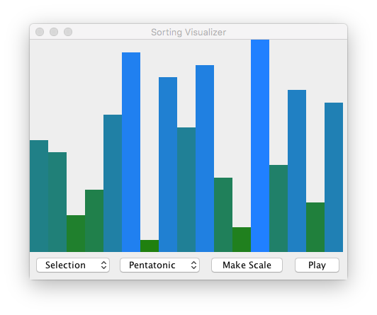

# The Sounds of Sorting

*(This assignment is inspired by the work of [Timo Bingmann](http://panthema.net/2013/sound-of-sorting/) and [Casey Rule](http://www.caseyrule.com/projects/sounds-of-sorting/)!)*

In this assignment, we will build both a *visualizer* and *audibilizer* for the various sorting algorithms that we implemented during the week.

You can access the Github repo for this assignment here:

* [psosera/the-sounds-of-sorting](https://github.com/psosera/the-sounds-of-sorting)

## Package Structure

This is the largest Java program that we have implemented so far as it will require many Java files for all the classes we will write.
To help manage this complexity, we will organize our Java classes into various packages which allows us to arrange collections of source files into logical units.

Like previous projects, our code will exist in the `edu.grinnell.csc207.soundsofsorting` package.
Within this package, organize your source files as follows:

* Files related to your sorting algorithms should be placed in the `sorts` subpackage.
* Files related to sorting events should be placed in the `events` subpackage.
* Files related to rendering should be placed in the `rendering` subpackage.
* Files related to audio should be placed in the `audio` subpackage.

## Part 1: Sorting Algorithms

First, we will implement a number of sorting algorithms over *generic arrays* as discussed in class.
The sorting algorithms you need to implement and subsequently instrument in the next part are:

1. Selection Sort
2. Insertion Sort
3. Bubble Sort
4. Merge Sort
5. Quick Sort

In addition, you should implement *one additional comparison-based sorting algorithm* beyond the five listed above.
You may choose to implement a sorting algorithm that you find online, *e.g.*, [the Wikipedia article on Sorting Algorithms](https://en.wikipedia.org/wiki/Sorting_algorithm), or come up with on your own.
There are no time or space complexity requirements, but your sort must be processable by the sorting event architecture you develop in the next section.

Your sorts should operate over *generic array* and be implemented in a file called `Sorts.java` (found in the `edu.grinnell.csc207.soundsofsorting.sorts` package).
For example, the signature of selection sort would be:

~~~java
public static <T extends Comparable<T>> void selectionSort(T[] arr) { /* ... */ }
~~~

In addition to `Sorts.java`, you should also implement a *JUnit test suite* for each sorting function in a file called `SortsTest.java`.
For each sort, you should have a test method that exercises the sort over 3–5 examples.
Make sure to choose diverse examples that explore both the common and corner cases for that particular sort.

## Part 2: Instrumenting Our Sorting Algorithms

In order to visualize and audibilize our sorting algorithms, we must *instrument* our sorting algorithms so that we can see how they mutate the input list at each step.
There are various advanced techniques for doing this, *e.g.*, callbacks or continuations.
For this project, we will simply *log* the interesting operations that our sorting algorithms perform and store them in a *list* for playback later.

We'll represent these possible *sorting events* as a collection of classes united by a common interface.
This interface is `SortEvent<T>` which represents a sort event over a generic list of `T`s.
The `SortEvent<T>` interface possesses the following methods:

* `void apply(arr)`: applies this sort event to the given array.
* `List<Integer> getAffectedIndices()`: returns a list containing all the indices that this event affects.
* `boolean isEmphasized()`: return true if this event should be emphasized by the visualizer/audibilizer.

There are three kinds of events to implement:

*   *Compare Events* that are logged whenever an algorithm compares two elements of the array.
    Compare events are not emphasized, and their affected indices are the indices of the elements being compared.
    Applying a compare event does nothing to an array.
*   *Swap Events* that logged whenever an algorithm swaps elements of the array.
    Swap events are emphasized, and their affected indices are the indices of the elements being swapped.
    Applying a swap event swaps the recorded indices of the array.
*   *Copy Events* that fire whenever an algorithm copies an element into an index of the array.
    Copy events are emphasized, and the affected index is the destination of the copy.
    Applying a copy event performs the copy of the recorded value into the array, overwriting the value 

You should implement three classes, `CompareEvent<T>`, `SwapEvent<T>`, and `CopyEvent<T>` that implement the `SortEvent<T>` interface and the behavior described above.

On top of these events, you should implement one final sort in `Sorts.java`:

* `<T> void eventSort(T[] l, List<SortEvent<T>> events)`, : given an array of `T`s and list of `SortEvent<T>` objects, apply those events to the list in-order.

To instrument your sorting algorithms:

1.  Implement the `SortEvent<T>` class hierarchy.
2.  Augment your sorting algorithms in `Sorts.java` so that instead of returning nothing (`void`), they create and return a list of `SortEvent<T>` objects that capture all the events that the given algorithm generates.
3.  Implement `eventSort` as described above.
4.  Augment your sorting tests in `SortsTest.java` to test that the lists of `SortEvent<T>`s generated by each sorting algorithm also capture the behavior of the algorithm.

In particular, your tests should ensure that if an algorithm generates a list `l` of events, then `eventSort(originalArr, l)` should sort the (original) list as long as the algorithm correctly sorted the list to begin with.
It will be useful to create a copy of your array using [Arrays.copyOf](https://docs.oracle.com/en/java/javase/23/docs/api/java.base/java/util/Arrays.html#copyOf(T%5B%5D,int)).

## Part 3: The Visualizer and Audibilzer

With the engine of the program completed, you can now integrate it into the SortingVisualizer graphical user interface (GUI).
We have provided the core of the GUI code for this program for you:

* `SortingVisualizer.java`: the entry point of the program.
* `ArrayPanel.java`: the portion of the GUI that renders the note indices to the screen.
* `ControlPanel.java`: the portion of the GUI that contains widgets to control the program.
* `Scale.java`: an object that encapsulates a musical scale represented by a collection of [MIDI](https://en.wikipedia.org/wiki/MIDI) notes.
* `NoteIndices.java`: an object that encapsulates a collection of indices into a particular Scale object.

Most importantly, `Scale` and `NoteIndices` connects your engine to the GUI.
Rather than sorting the notes of a `Scale` directly, you will instead sort an array of indices into this `Scale` (as retrieved by the `getNotes` method of the `NoteIndicies` class).
We use this design so that we can render each note uniformly in the `ArrayPanel` class.
For example, then notes of the B minor pentatonic scale are given by the following MIDI note values:

~~~{.java}
// In ControlPanel.java...
public static final int[] bMinorPentatonicValues =
    new int[] { 46, 49, 51, 53, 56, 58, 61, 63, 65, 68, 70, 73, 75, 78, 82, 85, 87 };
~~~

A `NoteIndices` object that contains indices into this scale may possess an array as follows:

~~~ {.java}
[6, 1, 10, 12, 2, 8, 16, 5, 13, 7, 9, 0, 11, 14, 3, 15, 4]
~~~

Here, the values of the array correspond to indices into the scale.
For example, at index 5 of this array is the index 8 which corresponds to the MIDI value 65 (*i.e.*, index 8 of `bMinorPentatonicValues`).

The renderer, `ArrayPanel`, renders each of the indices as a bar whose height corresponds to the index found in the `NoteIndices` array.
For example, here is an example of rendering a particular array of indices:

This image corresponds to the following indices array:

~~~ {.java}
[8, 7, 2, 4, 10, 15, 0, 13, 9, 14, 5, 1, 16, 6, 12, 3, 11]
~~~

Note that the 7th bar is the smallest because it corresponds to index 6 which contains 0.
In contrast, the 13th bar (index 11) is the largest because it contains 16---the largest value in the array.
The largest bar extends to the top of the panel whereas the smallest bar is the smallest sliver.

To render a particular sort, we first generate a list of sorting events on a copy of the indices array.
Then, we replay the sort, event-by-event on the original array.
On every event, we play MIDI notes (using our `Scale` object) corresponding to the affected indices of the sorting event.

To complete the program, you should:

1.  Implement the stubbed methods in `NoteIndices.java`
2.  Complete the stubbed method in `ArrayPanel.java`.
    Use the methods of the [Graphics](https://docs.oracle.com/javase/8/docs/api/java/awt/Graphics.html) object to render each element of the indices array in the panel's `NoteIndices` object.
3.  Implement the stubbed methods in `ControlPanel.java` to tie it all together.
