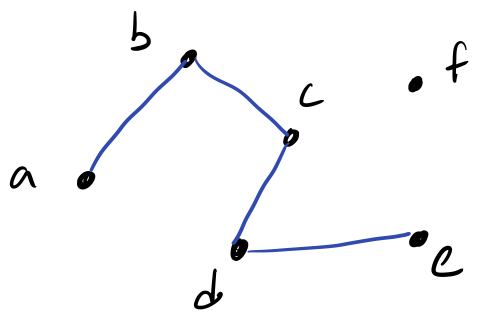
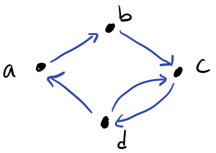
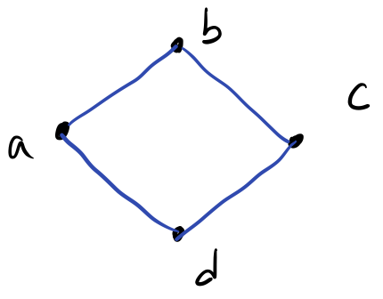
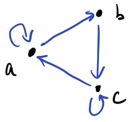
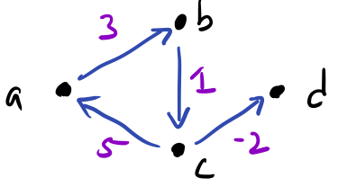
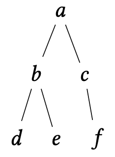

# Introduction to Graphs

Recall that a relation models a relationship between objects.
Of particular note are _binary_ relations which capture relationships between pairs of objects drawn from the same universe.
For example, we might consider:

+   An ordering relationship $(\leq)$ between members of $\mathbb{N}$.
+   A friendship relationship between friends.
+   A connectedness relationship between cities by roads or available flights.
+   A transition relationship between states in an abstract machine.
    For example, an idealized traffic light is such an abstract machine where the traffic light switches between "green", "yellow", and "red."

Binary relationships are ubiquitous in mathematics and computer science, and they all have a similar structure: a relation $R : 𝒰 × 𝒰$.
Can we exploit this structure to talk about _all_ these sorts of relationships in a uniform manner?
Is there a set of universal definitions and properties that apply to binary relations?

This is precisely the study of _graph theory_, the next area of discrete mathematics we'll examine in this course.
Graph theory is really the study of binary relations, although we more commonly think of a _graph_ as a visual object with nodes and edges.

## Basic Definitions

Consider the following abstract binary relation over universe $𝒰 = \set{a, b, c, d, e, f}$.

$$
R = \set{(a, b), (b, c), (c, d), (d, e)}.
$$

A _graph_ allows us to visualize these relationships.
Here is an example of a such graph for this relation:

We call the elements $a, …, f$ _vertices_ or _nodes_ of the graph.
For each related pair of elements, we draw a line called an _edge_ in our graph.

While our graph is simply a graphical representation of our binary relation, we traditionally represent a graph using a slightly different structure.
We say that the graph above is $G = (V, E)$.
That is, graph $G$ is a _pair of sets_:

+   $V$ is the _set of vertices_ in the graph.
    Here $V = \set{a, b, c, d, e, f}$.
+   $E$ is the _set of edges_ in the graph.
    Here $E = \set{(a, b), (b, c), (c, d), (d, e)}$.

~~~admonish info title="Definition (Graph)"
A _graph_ $G$ is a pair of sets:

+   $V$, the set of _vertices_ or _nodes_ of the graph.
+   $E : V \times V$, the set of _edges_ of the graph.
~~~

Because we talk about edges so much, we frequently write the edge $(a, b) \in E$ as $ab \in E$, _i.e._, we drop the pair notation and simply write the vertices together.

~~~admonish problem title="Exercise (Sketchin')"
Draw the graph $G = (V, E)$ where:

+   $V = \set{a, b, c, d, e, f, g}$.
+   $E = \set{ag, bg, cg, dg, eg, fg}$.
~~~

## Variations

The fundamental definition of a graph is a simple riff on a binary relation.
We call such graphs _simple graphs_.
However, there exists several variations of graphs that accommodate the wide range of scenarios we might find ourselves in.

### Directed versus Undirected Graphs

Because individual relationships are encoded as pairs, the order matters between vertices.
For example, the pair $(a, b)$ is distinct from the pair $(b, a)$.
In a _directed_ graph or _digraph_, we acknowledge this fact and distinguish between the two orderings.

For example, consider the following graph $G = (V, E)$ with

+   $V = \set{a, b, c, d}$.
+   $E = \set{ab, bc, cd, dc, da}$.

If we consider this graph directed, we would draw it as follows:

Note that the edges are _directed edges_ where the direction is indicated by an arrowhead.
If we were to have two vertices be mutually related, _i.e._, related in both directions, we need two edges, one for each direction.
For example, $c$ and $d$ are mutually related, so we connect them with two edges $cd$ and $dc$.

In contrast, we can consider $G$ to be _undirected_ where we do not distinguish between the two orderings.
Effectively, this means relations are unordered _sets_ rather ordered pairs, but in terms of notation, we still keep $E : V × V$.
If we consider $G$ to be undirected, we would draw it as follows:

Here, the edges are _undirected_, _i.e._, without arrowheads.
Effectively, we treat a single edge pair as relating symmetrically by default, so the edge $ab$ implies that $a$ is related to $b$ _and_ $b$ is related to $a$.
Because of this, we should not include symmetric pairs in our set of edges.
So we should define $E$ for the above graph as $E = \set{ab, bc, cd, da}$ where we removed the symmetric pair $dc$.

When should we employ a directed versus undirected graph?
We should employ a directed graph where it is not assumed that our relation is symmetric for every pair of related vertices.
For example, a "loves"-style relationship where $a$ loves $b$ is not inherently symmetric since $b$ might not love $a$.
A directed graph allows us to represent this distinction.
A directed graph can always represent an undirected graph by explicitly including symmetric edges.
Therefore, we can think of an undirected graph as a _shortcut_ where we can avoid writing extras edges if we know that our relation is already symmetric.
For example, a "friends"-style relationship is symmetric because $a$ being friends with $b$ implies that $b$ is also $a$'s friend.

### Self-loops

Like symmetry, we may or may not take reflexivity of a relation for granted.
If we do not take this for granted, _i.e._, some elements are reflexively related but not all of them are, then we might consider introducing _self-loops_ into a graph.
For example, consider the following digraph $G = (V, E)$ with $E = \set{ab, bc, ca, aa, cc}$.

In this graph, $a$ and $c$ are related to themselves, but not $b$.

### Weights and Multi-graphs

Edges encode relations between objects in a graph.
We can also carry additional information on these edges dependent on context.
Most commonly, we will add numeric _weights_ to our edges, _e.g._, to capture the distance between cities, or the cost of moving from one state to another.
Both directed and undirected graphs can be weighted.
As an example, consider the digraph $G = (V, E)$ with $E = \set{ab, bc, ca, cd}$.

We annotate the edges with a _weight_ whose interpretation depends on context.
For example, we can see that the edge $ca$ has weight 5.
We represent the weights on our graph formally with an additional structure, a function $W : E → ℤ$, that maps edges to weight value.
The codomain of $W$ can be whatever type is appropriate for the problem at hand; here we choose integers ($ℤ$).
For the above graph, we would define our weight function as:

$$
\begin{align*}
W(ab) =&\; 3 \\
W(bc) =&\; 1 \\
W(ca) =&\; 5 \\
W(cd) =&\; -2
\end{align*}
$$

We can also extend our graphs further by extending $E$ to be a _multiset_, a set that tracks duplicate elements.
This allows us to express the idea of multiple edges, _e.g._, with different weights according to $W$.

### Simple Graphs Revisited

Now that we have introduced various variations on a graph, we can finally come back and formally define a simple graph as a graph with no such variations.

~~~admonish title="Definition (Simple Graph)"
A _simple graph_ is an undirected, unweighted graph with no self-loops.
~~~

In closing, we have many variations of a graph that we might consider.
In successive readings, we'll consider various analyses over graphs and problems we might try to solve.
The beauty of graph theory is that because graphs are so general, by defining and solving problems in terms of graphs, we can apply our solutions to a whole host of problems!

~~~admonish problem title="Exercise (What's That?, ‡)"
Consider the following formal definition of an abstract graph $G = (V, E)$ with:

$$
\begin{gather*}
V = \set{a, b, c, d, e} \\
E = \set{(a, b), (a, c), (a, d), (a, e), (c, d), (c, e), (b, e)}
\end{gather*}
$$

1.  Draw $G$.
2.  Instantiate this abstract graph to a real-life scenario.
    Describe what objects the vertices $V$ represent and what relationship between objects is captured by $E$.
3.  Observe that $c$, $d$, and $e$ are mutually connected in this graph, _i.e._, each vertex has an edge to the other.
    Interpret the fact that they are mutually connected in your real-life scenario.
    Is the fact that they are mutually connected have special meaning in the scenario you envisioned?
~~~

## Trees

Frequently the relations we draw between objects are hierarchical in nature.
That is the objects have a parent-to-child relationship, for example:

+   A literal parent and their children.
+   A manager and the employees that report to them.
+   A folder and the files it contains.

We represent these relationships with a specialized kind of graph called a _tree_.

~~~admonish info title="Definition (Tree)"
A _tree_ is an undirected graph that contains no cycles.
~~~

Here is an artificial example of a tree with five nodes, $a$--$f$:

We distinguish a vertex of the tree as its _root_.
Here we'll consider $a$ to be the root of the tree although any of the vertices could be considered the root.
By convention, we draw trees "upside down" with the root at the top and the tree growing downwards.

The root allows us to categorize the vertices of the tree by their distance from the root.
We call a collection of vertices that are the same distance away from the root a _level_.

~~~admonish info title="Definition (Level (Tree))"
Let $T = (V, E)$ be a tree with a distinguished root $r$.
Define the $i$th _level_ of a tree, denoted $L_i$ to be the set of vertices that are $i$ nodes away from $r$:

$$
L_i = \{\, v \mid \text{$v \in V$ and there exists a path of length $i$ from $r$ to $v$} \,\}.
$$
~~~

~~~admonish info title="Definition (Height)"
The _height_ at tree is the maximum level of any of its vertices.
~~~

In our above example:

$$
\begin{align*}
L_0 =&\; \{\, a \,\} \\
L_1 =&\; \{\, b, c \,\} \\
L_2 =&\; \{\, d, e, f \, \} \\
\end{align*}
$$

And the tree has height 2.
Note that $L_k$ for any $k > 2$ is $\emptyset$ since there are no nodes greater than 2 away from $A$.

With levels defined, we can now formally define the parent-child relationship that characterizes trees:

~~~admonish info title="Definition (Parent)"
The _parent_ of a vertex $v$ at level $i$ of a tree is the node $u$ for which the edge $(u, v)$ is in the tree and
$u$ is at level $i - 1$.
~~~

~~~admonish info title="Definition (Children)"
The _children_ of a vertex $u$ at level $i$ of a tree are the nodes $V$ for which each $v \in V$, the edge $(u, v)$ is in the tree and $v$ is at level $i + 1$.
~~~

Because a tree contains no cycles and the tree is rooted at a particular node, it follows that every vertex of a tree except the root has exactly one parent.
(This is a worthwhile claim to prove yourself for practice!)

We can categorize trees by the maximal number of children any single node possesses.
We call this value the tree's _fan-out_:

~~~admonish info title="Definition (Fan-out)"
The _fan-out_ of a tree $k$ is the maximum number of children that any one vertex of the tree possesses.
We call such a tree a $k$-ary tree or a $k$-tree for short.
Notably a $1$-tree is a _sequence_ or a _list_, and a $2$-tree is a _binary tree_.
~~~

Finally, we've restricted ourselves to _connected_ trees, trees in which all its vertices are mutually reachable.
If a graph is unconnected, but all of its connected components themselves are trees, then we call the graph a _forest_:

~~~admonish info title="Definition (Connected Components)"
Call an undirected graph $G = ( V, E )$ _connected_ if there exists a path between every pair of vertices in $G$.
A _connected component_ $G'$ of $G$ is a sub-graph of $G$ that is, itself, connected.
~~~

~~~admonish info title="Definition (Forest)"
A graph is a _forest_ if all of its connected components are trees.
~~~

### Directed Acyclic Graphs

We generally assume that a tree is an undirected graph.
However, we can apply the same concepts to a directed graph.
This results in a kind of graph called a _directed acyclic graph_ (DAG):

~~~admonish info title="Definition (Directed Acylic Graph)"
A _directed acyclic graph_ (DAG) is a directed graph that contains no cycles.
~~~

DAGs are outside the scope of our discussion of the basics of graphs, but be aware that DAGs have their own interesting properties and operations distinct from trees!

## Depth-First Tree Traversals

Previously, we learned about depth-first and breadth-first traversals for graphs.
Breadth-first traversals remain the same: we traverse the vertices of the tree by order of increasing level. 
However, the specialized nature of trees lets us specify different sorts of depth-first traversals, in particular, for _binary trees_ where every node possesses at most two children.
In such a tree, we call one child the _left child_ and the other child the _right child_.

With this in mind, we can describe a recursive algorithm for depth-first search specialized to binary trees.
In the Python-like code below, we use dot-notation to denote children, _e.g._, `v.l` for `v`'s left child and
`v.r` for `v`'s right child.

~~~python
def preDFS(u):
    visit(u)
    preDFS(u.l)
    preDFS(u.r)
~~~

Note that we visit the node `u` before visiting its children.
Performing this traversal on our example tree from the beginning of this section yields the sequence: 

$$
a, b, d, e, c, f.
$$

This kind of depth-first traversal of the tree is called a _pre-order_ traversal of the tree.
We first visit the current element and then visit its children.

In contrast, a _post-order_ traversal of the tree visits the children
first and then the current node last.

~~~python
def postDFS(u):
    postDFS(u.l)
    postDFS(u.r)
    visit(u)
~~~

A post-order traversal of the graph yields the following sequence:

$$
d, e, b, f, c, a.
$$

Finally, we can intermix visiting children and visiting the current node with an _in-order_ traversal:

~~~python
def inDFS(u):
    inDFS(u.l)
    inDFS(u.r)
    visit(u)
~~~

An in-order traversal yields the following sequence: 

$$
d, b, e, a, c, f.
$$
