# Spanning Trees

Consider a graph $G = (V, E)$. A *spanning tree* of $G$ is a subgraph
$G' = (V', E')$ (with $V' \subseteq V$ and $E' \subseteq E$) that is a
tree (*i.e.*, contains no cycles) that covers every vertex of $G$. That
is $V' = V$. For example, consider the following graph:

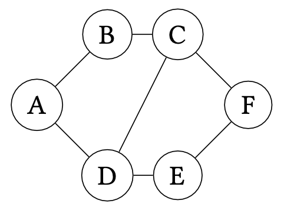

A spanning tree for the graph is given below:

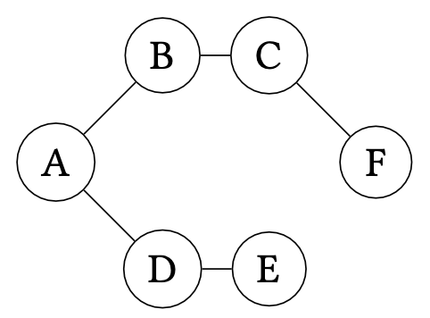

Spanning trees are not necessarily unique. For example, here is a
different spanning tree for the graph.

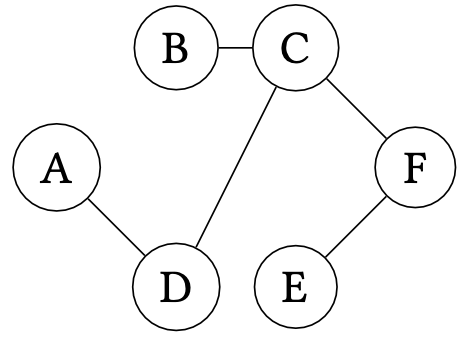

Constructing a spanning tree for a graph is useful in many situations, for example:

+   Consider an electrical network for a neighborhood where nodes represents houses and edges represent potential electrical connections between houses.
    A spanning tree in this context represents a minimal set of electrical connections used to connect all of the houses to the power grid.

+   Consider a collection of networked computers where nodes represent computers and edges represent physical connections between computers.
    A spanning tree in this context represents a minimal collection of connections that allow one machine to communicate with another without the fear of encountering a _routing loop_ where a message is relayed between a collection of machines in perpetuity.

~~~admonish problem title="Exercise (Sizes of Spanning Trees)"
Say that we have a graph $G = (V, E)$.
What is the number of edges of any spanning tree of $G$?
Prove your claim.
~~~

## Constructing Spanning Trees

To construct a spanning tree, we can employ either traversal algorithm we have discussed for graphs---_breadth-first_ or _depth-first_ search---to reach every vertex from some arbitrary starting vertex.
When processing a vertex $v$, we add to our working set each vertex $v'$ connected to $v$ (_i.e._, $(v, v') \in E$) that we haven't already seen.
If we are performing breadth-first search, we treat the working set like a queue, processing the oldest entry in the working set first.
If we are performing depth-first search, we treat the working set like a stack, processing the newest entry in the working set first.

For example, the first spanning tree we discussed previously is the result of a breadth-first traversal, namely: 

$$
A, B, D, C, E, F.
$$

The second spanning tree is the result of a depth-first traversal, namely:

$$
A, D, C, B, F, E.
$$

~~~admonish problem title="Exercise (Runtime of Spanning Tree Construction)"
Prove that for a graph $G = (V, E)$, we must process exactly $V - 1$ vertices when constructing the spanning tree, irrespective of the traversal used to generate the tree.
~~~

## Minimum Spanning Trees

Now, let's consider extending our graph edges with _weights_.
Each weight represents a "cost" associated with that edge, for example:

+   Distances if the edges represent connections between physical
    places.
+   Monetary amounts if the edges represent a transformation from one
    kind of object to another.

Let:

$$
\mathsf{weight}(E) = \sum_{(v_1, v_2, w) \in E} w
$$

Be the sum of the weights of all the edges in $E$.

With a weighted graph, we can refine our notion of spanning tree.
We can now consider _minimum spanning trees_ (MST), a spanning tree with minimal cost.
Formally defined:

~~~admonish info title="Definition (Minimum Spanning Tree)"
Let $G = (V, E)$ be a weighted graph.
Then a _minimum spanning tree_, $T_1 = (V_1, E_1)$, be a spanning tree of $G$ such that for any other spanning tree $T_2 = (V_2, E_2)$ of $G$, it is the case that $\mathsf{weight}(E_1) \leq \mathsf{weight}(E_2)$.
~~~

In our above examples, we could attach an appropriate cost to each graph:

+   Weights in the electrical network represent physical distance
    between houses.
+   Weights in the computer network represent the average time it takes
    for two computers to communicate with each other.

Minimum spanning trees for each of these examples then also minimize the values of these trees---physical distances and average communication time, respectively---in addition to "spanning" the graphs.

## Algorithms for Minimum Spanning Trees

Note that our current methods for constructing minimum spanning trees are agnostic to the weights of the edges.
Even though such algorithms choose a minimal number of edges, this doesn't guarantee that the weight of the resulting spanning tree is minimized.
For example, consider the following weighted graph:

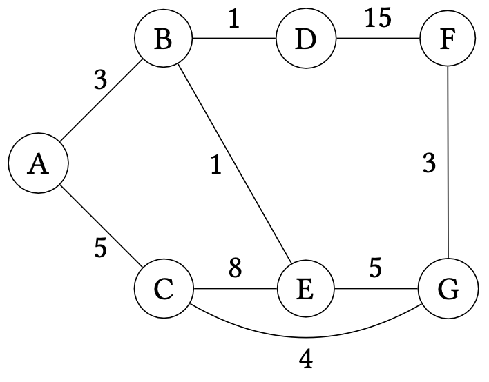

A BFS traversal of the graph starting at $A$ produces the following weighted graph:

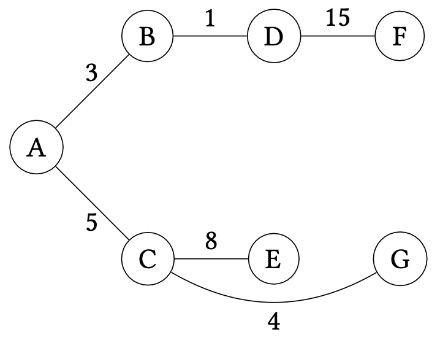

Its weight is $3 + 1 + 15 + 5 + 8 + 4 = 36$ but it is not minimal.
The following minimum spanning tree is minimal for our graph:

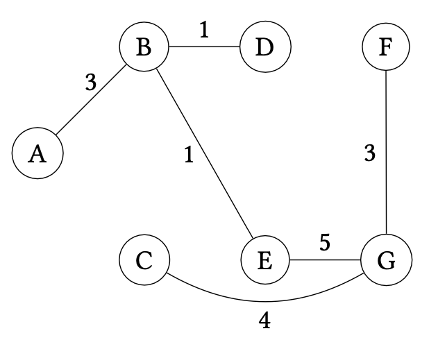

The weight of this MST is $3 + 1 + 1 + 3 + 5 + 4 = 17$.
We clearly need another method of calculating a MST that takes into account (a) the vertices we have yet to explore and (b) the weights of the chosen edges.

There are several algorithms that we could consider.
Here, we will consider _Prim's Algorithm_ which we will present as a modification of breadth-first search for this setting.
To gain some intuition about how to proceed, let's see how naive breadth-first search failed to produce the MST and then modify the algorithm to obtain the desired result.

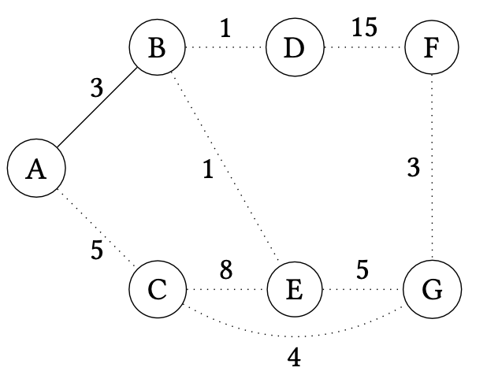

Initially, we begin our BFS at $A$ and then add $B$.
We can think of $A$ and $B$ and the edge $AB$ as part of our MST.
Our goal is to figure out which edge to add to the MST next.
Note that we must pick an edge that does not create a loop in the MST, thus we must only consider edges that connect the MST to a vertex not already in the MST.

At this point, BFS would consider $C$ next.
However, we see that the edge $AC$ is not in the MST.
This is because it turns out it is more profitable to instead include vertex $C$ by way of edge $CG$ instead.
How can we avoid making this choice?
Note that we have three edges to choose from at this point---$AC$, $BD$, and $BE$---and the last two edges have a lower weight (1) than $AC$ (5).
It seems like we should consider one of these edges first since its weight is smaller.

If we choose $BD$, we obtain the following extended MST that includes $A$, $B$, and $D$:

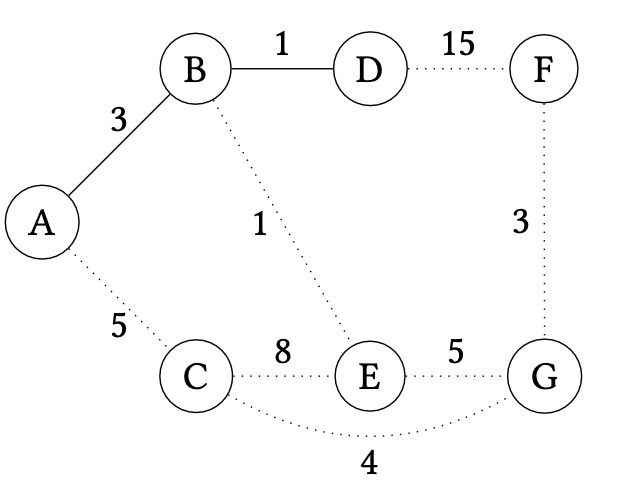

Now we can consider the following edges:

+   $AC$---cost 5,
+   $BE$---cost 1, and
+   $DF$---cost 15.

By considering the _lowest weight edge_ next, we then add $BE$ to the MST:

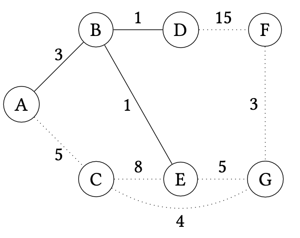

We continue in this manner, considering the lowest weight edge that expands the MST by one vertex.
We would next add $EG$ (cost 5):

Next we would add $FG$ (cost 3):

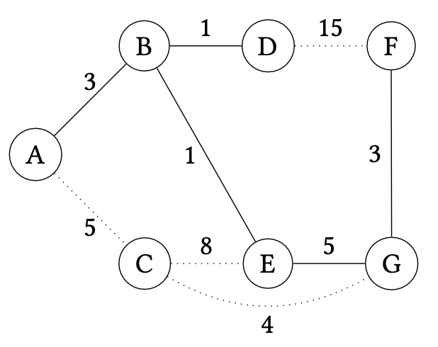

And then finally $CG$ (cost 4):

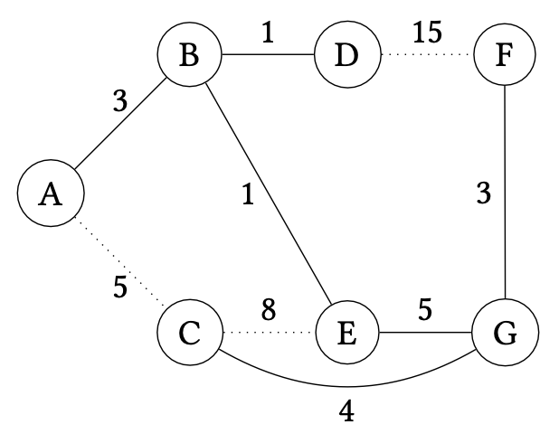

At this point, we know we are done because there are no other vertices left to add to the graph.
Alternatively, we know that any tree of the graph contains $|V| - 1$ edges, so once we add this number of edges, we can safely stop.

To summarize, Prim's algorithm proceeds as follows on a graph $G = (V, E)$:

+   Choose a start vertex $s \in V$ as an initial $T$ consisting of just $s$.
+   For $|V| - 1$ times:
    -   Choose the minimum weight edge $e \in E$ that connects $T$ with a vertex not in $T$ and add $e$ to $T$.
+   Afterwards $T$ is a MST for $G$.

Prim's algorithm is an example of a _greedy algorithm_.
A greedy algorithm is one that, for each iteration, makes its next choice by choosing the minimum or maximum option available.
Here, that choice is the minimum weight edge that expands the current MST.
However, how do we know this choice is correct?

To prove that our greedy choice is correct, we must first introduce the notion of a _cut_.

~~~admonish info title="Definition (Cut)"
$G = (V, E)$ be a graph.
A _cut_ of the graph is a partition of its vertices $(S, V - S)$ with $S ⊆ V$.
A _non-trivial_ cut is one where $S ≠ ∅$ and $S ≠ V$.
~~~

Since $S$ in the above definition uniquely identifies the cut, we will refer to the cut by $S$ for notational convenience.

Cuts allow us to talk about the state of Prim's algorithm precisely.
At any iteration of the algorithm, we may view the MST $T = (V', E')$ as inducing a cut $V'$ of $G$.
The algorithm then considers the minimum weight edge that flows between vertices of the cut, _i.e._, vertices of the form $u, v$ with $u ∈ V'$ and $v ∈ V - V'$.
We must show that this edge belongs to some MST of $G$.
In particular, we'll show that it can belong to the _eventual_ MST $T^*$ of the graph grown from the current MST $T$, that is, $T ⊆ T^*$.

~~~admonish exercise title="Claim (Cut Property)"
Let $G = (V, E)$ be a graph and $T = (V', E')$ with $V' ⊆ V$ and $E' ⊆ E$ be a minimum spanning tree for $V'$.
Consider the set of edges $D$ that connect a vertex in $T$ to a vertex not in $T$, *i.e.*,

$$
D = \{\, (u, v) \mid (u, v) \in E, u \in V', v \in V - V' \,\},
$$

And let $e$ be an edge with minimum weight of $D$.
$e$ belongs to some MST $T^*$ of $G$ where $T ⊆ T^*$.
~~~

~~~admonish check title="Proof"
We prove this fact by contradiction.
Let the cut induced by $T = (V', E')$ be $(V', V - V')$ and the minimum weight edge under consideration be $e = (u, v)$ with $u \in V'$ and $v \in V - V'$.
Suppose for the sake of contradiction that $e$ does not belong to any MST of $G$ of which $T$ is a subtree.
Now consider an arbitrary MST of $G$, call it $T^*_2$. Note that because $v$ must be connected in $T^*_2$, if $e$ does not connect $e$ in $T^*_2$, there must exist some other path between $T$ and $v$ in $T^*_2$. Let the edge in this path that flows across the cut induced by $T$ be $e'$.

Now, consider the alternative tree of $G$ where we replace $e'$ with $e$, call it $T^*_1$. $T^*_1$ is a spanning tree because any vertex that was reachable through $e'$ is now reachable through $e$.
Furthermore, note that $e$ and $e'$ are both edges across the cut induced by $T$, but $e$ is assumed to have minimum weight among such edges.
Therefore, $\mathsf{weight}(e) \leq \mathsf{weight}(e')$.
But $T^*_1$ only differs from $T^*_2$ in this edge, so we can conclude that $\mathsf{weight}(T^*_1) \leq \mathsf{weight}(T^*_2)$ which implies that $\mathsf{weight}(T^*_1)$ is a MST for $G$, a contradiction since $e$ belongs to it.
~~~

This argument is an example of an  _exchange argument_ for greedy algorithms.
We justify the greedy choice by arguing that any "sub-optimal" choice could be substituted by the greedy choice to obtain a solution at least as good as the original one.
Our argument accounts for the fact that since edge weights are not necessarily distinct that $e$ and $e'$ could be
both valid minimal choices.
The resulting MSTs are, therefore, potentially different, but both have the same (minimal) weight.
Note that if the edge weights of $G$ are distinct, then $e$ is the minimum weight edge of the cut and thus $T^*_2$ in the proof above is not a MST; $T^*_1$. This implies that in the case where edge weights are distinct, the minimum weight edge $e$ must belong to _any_ MST of $G$, not just one of them.

We can use this lemma to prove the correctness of Prim's algorithm easily.
The algorithm maintains a MST for the vertices it contains so far, extending the MST by one edge (and thus, one vertex) on each iteration.
We therefore prove the correctness of Prim's algorithm by induction of the number of iterations of its loop, claiming that $T$ is a MST for the vertices it contains so far.

~~~admonish problem title="Claim (Correctness of Prim's Algorithm)"
On the $n$-th iteration of Prim's on a graph $G = (V, E)$, $T = (V', E')$ with $V' \subseteq V$ and $E \subseteq E'$ is a MST for $V'$.*
~~~

~~~admonish check title="Proof"
By induction on $n$.

+   $n = 0$. Initially $T$ contains a single vertex and is trivially a MST for that one vertex.
+   $n = k + 1$.
    Our induction hypothesis says that on iteration $k$, $T = (V', E')$ is a MST for $V'$ In the $(k + 1)$-st iteration, we extend $T$ with an edge $e$ across the cut induced by $T$.
    By the Cut Property, we know that $e$ can belong some MST $T^*$ of $G$ with $T^* ⊆ T$.
    Therefore, we know that $T$ extended with $e$ is a MST for its vertices.
~~~
