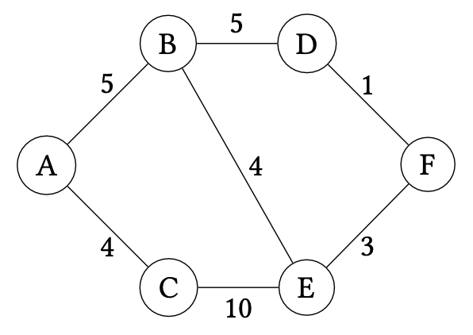
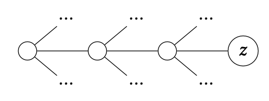

# Shortest Paths

A related problem to minimum spanning trees is _shortest paths_.
That is, what is the shortest path between two vertices in a graph, say $a$ and $b$.
A naive greedy approach seems compelling given our exploration of minimum spanning trees.
For example, consider the following graph:

Suppose we want to find the shortest path from $A$ to $F$.
We could try to start from $A$, and choose the edge with the least weight to traverse next, eventually arriving at $F$.
However, this yields the path $A, C, E, F$ which has total weight $4 + 10 + 3 = 17$.
The optimal path instead is the top path of the graph: $A, B, D, F$ with total weight $5 + 5 + 1 = 11$.
Note that even if we were to divine that it is better to go to $B$ from $A$, we encounter the same problem at $B$: a greedy choice will send us down to $E$ (at cost 4) when traversing $D$ would have been the correct move!

More generally, this approach has the problem where it may send us down a sub-optimal path:

For example, we may reach vertex $z$ in the graph above only to find that we are either in a sub-optimal path or worse yet, that the target node of our path is unreachable from $z$!
In this case, we would be forced to backtrack to explore other possible paths.
In general, this occurs when a greedy choice fails: we have to "undo" our optimal choice and try other possibilities instead.
We may end up exploring all such possibilities exhaustively which is problematic if there are many possibilities to consider!
This realization might motivate us to dismiss any sort of greedy algorithm for this problem.
However, if we are smart in tracking enough information so that we never need to backtrack, we can retain a greedy approach!

The algorithm we'll consider is _Dijkstra's algorithm_ which we can think of as a refinement of Prim's algorithm for minimal path searching.
Note that Prim's proceeded by growing a minimal spanning tree from a single node.
Dijkstra's proceeds similarly, growing an optimal path from the start vertex under consideration.
However, unlike Prim's which only tracks the growing MST of interest, Dijkstra's does not just record the
current optimal path to the desired end vertex but _all_ such optimal paths to every vertex in the graph from the start vertex.
This additional information is sufficient for us to make greedy choices that always lead to the discovery of the optimal path.

Suppose we are interested in finding the shortest path from $A$ to $F$ in our example graph for this section.
Dijkstra's ultimately tracks the shortest path from $A$ _through the nodes it has visited so far_ to _all nodes in the graph_, refining these paths as it greedily consumes vertices in the graph.
Initially, we know that the shortest path from $A$ to itself is simply staying at $A$ for a cost of 0. For every other node, we don't know a path---indeed, such a path may not exist!---so we assign the value $∞$ to these paths.

| **Destination** | **Path** | **Cost** |
| --------------- | -------- | -------- |
|       $A$       |   $A$    |    0     |
|       $B$       |    ?     |   $∞$    |
|       $C$       |    ?     |   $∞$    |
|       $D$       |    ?     |   $∞$    |
|       $E$       |    ?     |   $∞$    |
|       $F$       |    ?     |   $∞$    |

We begin by considering $A$ and its edges.
We look at each edge incident to $A$ and update our table based on these edges.
When looking at these edges, we ask the question:

> Can taking this edge to a vertex $v$ give us a new optimal path from $A$ to $v$?

There are two such edges to consider: $AB$ and $AC$.
Since we don't know of any paths from $A$ to either of these edge's endpoints---represented by the fact that their entries in the table are $∞$---we can update our shortest paths entries for these vertices with these edges.

| **Destination** | **Path** | **Cost** |
| --------------- | -------- | -------- |
|       $A$       |   $A$    |    0     |
|       $B$       |   $AB$   |   $5$    |
|       $C$       |   $AC$   |   $4$    |
|       $D$       |    ?     |   $∞$    |
|       $E$       |    ?     |   $∞$    |
|       $F$       |    ?     |   $∞$    |

After processing these edges, we are done with $A$.
An invariant of the algorithm is that we never need to reconsider these edges again.
The important information about them has been recorded in the table, allowing us to avoid backtracking if an optimal path needs to be updated!

We now repeat the process by choosing a vertex that we have not yet visited and updating the table based on its incident edges that we have not yet considered.
Which vertex do we consider next?
This is where we'll make our greedy choice: we'll consider the vertex with _minimum cost_ according to the table that we have not yet visited.

In our running example, this is node $C$ with current path cost $4$.
We now update our table with $C$'s additional edge: $CE$.
Note that this edge gives us a path from $A$ to $E$; what is its length?
It is the length of the _optimal_ path from $A$ to $C$ plus the cost of traversing $CE$!
This quantity is $4 + 10 = 14$ corresponding to the path $ACE$.

| **Destination** | **Path** | **Cost** |
| --------------- | -------- | -------- |
|       $A$       |   $A$    |    0     |
|       $B$       |   $AB$   |   $5$    |
|       $C$       |   $AC$   |   $4$    |
|       $D$       |    ?     |   $∞$    |
|       $E$       |  $ACE$   |   $14$   |
|       $F$       |    ?     |   $∞$    |

Next we consider node $B$ since its current shortest path cost $4$ is lower than $E$'s cost $14$.
We thus consider edges $BD$ and $BE$ next.
Edge $BD$ updates the path to $D$ as expected.
However, edge $BE$ introduces a choice between two paths:

+   The _current shortest path_ in the table: $ACE$ with cost $14$.
+   The _candidate shortest path_ through $BE$.
    The cost of this path is the minimal cost of reaching $B$ from $A$ plus the cost of traversing $BE$: $5 + 4 = 9$.

We note that $9 < 14$ and thus the candidate path is shorter than our current best known path.
We therefore update the table to reflect the fact, recording a new best shortest path for $E$!

| **Destination** | **Path** | **Cost** |
| --------------- | -------- | -------- |
|       $A$       |   $A$    |    0     |
|       $B$       |   $AB$   |   $5$    |
|       $C$       |   $AC$   |   $4$    |
|       $D$       |  $ABD$   |   $10$   |
|       $E$       |  $ABE$   |   $9$    |
|       $F$       |    ?     |   $∞$    |

We next consider $E$ with current shortest path length $9$.
It has one unvisited incident edge, $EF$, allowing us to final reach our intended endpoint, $F$, with cost $9 + 3 = 12$.

| **Destination** | **Path** | **Cost** |
| --------------- | -------- | -------- |
|       $A$       |   $A$    |    0     |
|       $B$       |   $AB$   |   $5$    |
|       $C$       |   $AC$   |   $4$    |
|       $D$       |  $ABD$   |   $10$   |
|       $E$       |  $ABE$   |   $9$    |
|       $F$       |  $ABEF$  |   $12$   |

Now we will consider vertex $D$ with edge $DF$.
We employ the same logic here as with $B$. We need to compare the:
+   The current shortest path recorded in the table: $ABEF$ of length $12$.
+   The candidate shortest path through $D$: $ABDF$ of length $10 + 1 = 11$.

The candidate shortest path is shorter, so we update the table with the new path for $F$.

| **Destination** | **Path** | **Cost** |
| --------------- | -------- | -------- |
|       $A$       |   $A$    |    0     |
|       $B$       |   $AB$   |   $5$    |
|       $C$       |   $AC$   |   $4$    |
|       $D$       |  $ABD$   |   $10$   |
|       $E$       |  $ABE$   |   $9$    |
|       $F$       |  $ABDF$  |   $11$   |

Since $F$ has no unvisited edges to process, we don't need to do anything to process it, completing the search procedure.
We can now inspect the table to find the shortest path from $A$ to $F$, which is $ABEF$ of length $11$ as desired!

With this example, we see that the salient parts of Dijkstra's algorithm are:

+   Repeatedly choosing vertices to process based on their current, best-known shortest paths from the start vertex.
+   Comparing our current known shortest paths with paths through the current vertex under consideration and choosing the better of the two.

Let $G = (V, E)$ be an undirected graph.
Suppose that we are interested in finding all shortest paths starting from vertex $s \in V$.
Let $\mathsf{cost}(x)$ be the cost of the shortest known path from $s$ to $x$.
Dijkstra's algorithm proceeds as follows:

1.  Initially, let $\mathsf{cost}(s) = 0$ and $\mathsf{cost}(v) = ∞$ for all $u ∈ V$ that are not
    $s$.

2.  Repeatedly choose vertex $u$ that has minimal $\mathsf{cost}(v)$ among all vertices that have not yet
    been processed in $V$.
    +   For each edge $(u, v) ∈ E$ that has not yet been processed by the algorithm, update the shortest known path to $v$ as follows:

        $$
        \mathsf{cost}(v) ← \mathop{\mathrm{min}}(\mathsf{cost}(v), \mathsf{cost}(u) + \mathsf{weight}(uv))
        $$

After Dijkstra's algorithm completes, $\mathsf{cost}(t)$ records the shortest path from $s$ to $t$ in $G$ for all $t \in V$.

Note that our choice of initially assigning unknown paths the value $∞$ makes the description of our algorithm concise.
We don't need to define a special case for when we first find a path to a target vertex.
We will always choose the found path because $\infty$ is effectively larger than the length of any known path length we would consider during execution of the algorithm.