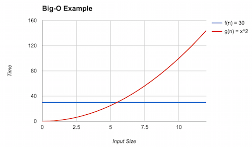

# Counting Operations

An appropriate description of an object or an algorithm readily admits a combinatorial description of its size or complexity.
This is especially important for computer scientists because we want to analyze the complexity of the programs we develop.
We measure the _complexity_ of a program by expected amount of resources that it consumes as a function of the size of its input.
By resources, we typically mean either the time the program takes to execute---its _time complexity_---or the amount of memory the program consumes while executing---its _space complexity_.
In CSC 207, you'll explore program complexity as it relates to the fundamental data structures of computer science.
In this reading, we'll approach the topic of program complexity as an exercise in _applied counting_.

## Critical Operations

The true amount of resources that a program takes to execute depends on many factors, _e.g._, applications running at the same time, the underlying operating system or hardware, most of which we cannot hope to easily capture with a mathematical function.
We therefore approximate the complexity of a function by choosing a measure that implies the amount of resources a program uses while executing but is ultimately independent of these particular details.
Usually, this measure is _the number of critical operations_ that a program executes.
The actual operations that we count are highly dependent on the program under consideration; we ultimately want to pick a minimal number of operations that is manageable to analyze but also accurately reflects the behavior of the program.
In particular, when we analyze _time complexity_, we can use our critical operation(s) as the "unit" of time that the program takes to execute.

For example, consider the standard `python` implementation of the `factorial` function:

~~~python
def factorial(n):
    if n == 0:
        return 1
    else:
        n * factorial(n-1)
~~~

A natural candidate for critical operations to count, here, are _multiplications_.
Multiplications are the _core behavior_ of the `factorial` computation.
Furthermore, we intuitively believe they are the most common operation that occurs in `factorial`.
Because of this, we can have confidence that the number of multiplications is a good approximation of the total time that `factorial` takes to run.

However, this is not the only operation we might consider.
For example, we might consider _equality comparisons_, _i.e._, how many times we evaluate `(= n 0)` during the evaluation of `factorial`.
Choosing equalities versus multiplications will lead in slightly different counts of total operations.
In CSC 207, you will learn about _Big-O notation_ that will allow you to conclude that these differences don't matter.
For now, we'll simply note that both are reasonable choices as critical operations without further proof.

## Counting Operations

Once we've identified our critical operations, we can now go about the business of counting them in our programs.
In the absence of branching constructs, _i.e._, _straight line code_, this is straightforward: simply count all the occurrences of the operation in the code!
For example, if we are counting _calls to `display`_ as our critical operations, then `display-string` above clearly calls `display` four times.

When we sequence a series of actions, _e.g._, with `begin`, we can take the union of their resulting operations, _i.e._, add them up.
For example, consider the following functions:

~~~python
def display_strings():
    print('!')
    print('#')
    print('@')
    print('%')

def f():
    display_strings()
    display_strings()
    display_strings()
~~~

`f` calls `display_strings` three times, each of which calls `print` three times, so there are $3 + 3 + 3 = 9$ calls to `print` made overall.

Things get more interesting when we move from straight-line code to code that involves branching.
We'll first focus on loops.
Let's attempt to count the number of times `display-range` calls `display`.

~~~python
def display_range(n):
    for i in range(n):
        print(i)
~~~

Here, the function in question calls `print` once for each element in `range(n)`.
The number of elements produced by `range(n)` is `n` since `(range n)` produces the list `[0, ..., n-1]`.
Thus, `display_range(n)` calls `print` $1 ⋅ n = n$ times.
We can express as a (mathematical) function of $n$, $f(n) = n$ represents the number of times `print` is called as a function of the input `n`.

Another tool that we can use to capture this quantity in a way that's more indicative of the structure of the code is _summation notation_.
We recognize that the loop performs a set of repeated, sequential actions that, as per our previous discussion, can be combined with addition.
Thus, we really have:

$$
f(n) = \underbrace{1 + 1 + ⋯ + 1}_{n}.
$$

Summation notation allows to express this repeated addition concisely:

$$
\sum_{i = 0}^{n-1} 1.
$$

We can think of a summation as the direct encoding of a `for`-loop.
It is composed of three parts:

+   Below the $\Sigma$ (upper-case sigma, $\LaTeX$: `\Sigma`), an _initializer for a bound variable_ that may appear in the body of the summation.
+   Above the $\Sigma$, an (inclusive) _upper-bound_ on the bound variable.
    This is the _final_ value of the bound variable of the summation.
+   To the right of the $\Sigma$, the _body_ of the summation which describes each summand.
    The body appears as a summand once for each value the bound variable takes on.

In this particular case, the bound variable is $i$, and it ranges from $0$ to $n - 1$, inclusive.
For each of these values of $i$, the summand $1$ appears in the overall sum.
In other words:

$$
\sum_{i = 0}^{n-1} 1 = \underbrace{1 + ⋯ + 1}_{n}.
$$

Note that the range from $0$ to $n - 1$, inclusive, includes $n$ numbers.
In contrast with computer programmers, mathematicians tend to use _1-indexing_ rather than _0-indexing_ as we normally do with our loops.
This would be the more colloquial way to write this summation in math terms.

$$
\sum_{i = 1}^{n} 1 = \underbrace{1 + ⋯ + 1}_{n}.
$$

In this particular case, the two summations are equivalent because the body of the summation doesn't reference $i$.
But if it does, then the meaning of the summation changes slightly.
For example, consider these two summations that mention the bound variable in their bodies:

$$
\begin{gather*}
\sum_{i = 0}^{n-1} i = 0 + 1 + ⋯ + (n-1) \\
\sum_{i=1}^{n} i = 1 + 2 + ⋯ + n = \frac{n(n+1)}{2}
\end{gather*}
$$

The change of lower- and upper-bounds of the variable resulted in a shift of the summands by one!
Note that we can fix this by adjusting our usage of the variable in the body of the summand.
For example, if we wanted to fix the $1$--$n$ summation so that it behaved like the $0$--$n - 1$ summation, we would write:

$$
\sum_{i = 1}^{n} (i-1) = (1-1) + (2-1) + ⋯ + (n-1) = 0 + 1 + ⋯ + (n-1).
$$

Summations can be manipulated algebraic either by unfolding their definition as we have done or by using known identities.
Examples of summation identities can be found in a variety of places, _e.g._, the [Wikipedia article on summations](https://en.wikipedia.org/wiki/Summation).

## Growth of Functions

Once we develop a mathematical function for the number of relevant operations an algorithm performs, we can categorize this function in terms of how fast it grows as its input grows:

-   **Constant Functions** are those functions that do not depend on their input.
    For example $f(x) = 300$ is a constant function that evaluates to $300$, irrespective of its input.
    A function that grabs the head, _i.e._, first element of a linked list is a constant function since the process does not depend on the size of the list.

-   **Linear Functions** take the form $f(x) = mx + b$ where $m$ and $b$
    are constants.
    They correspond to lines in a geometric sense.
    For example, walking an array takes linear time.

-   **Quadratic Functions** take the form $f(x) = ax^2 + bx + c$ where $a$, $b$, and $c$ are constants.
    They correspond to curves.
    Functions with quadratic complexity arise, for example, when we must perform an operation involving all possible pairs of a collection of objects.
    If there are $n$ objects, then there are $n \times n = n^2$ operations that must be performed.

-   **Cubic Functions** take the form $f(x) = ax^3 + bx^2 + cx + d$ where $a$, $b$, $c$, and $d$.
    They correspond to curves with an inflection point and have a slope greater than a quadratic function.
    Functions with cubic complexity arise, for example, when we must perform an operation involving all possible triples of a collection of objects.
    Like the quadratic case, if there are $n$ objects, then there are $n \times n \times n = n^3$ operations to be performed.

-   **Polynomial Functions** generalizes the previous functions discussed so far.
    A polynomial has the form $f(x) = \sum_{i} a_i x^i + c$ where each $a_i$ and $c$ are constants.
    We'll usually lump quadratic and cubic functions under the "polynomial" functions and be more specific when we want to talk about linear and constant functions.

-   **Exponential Functions** take the form $f(x) = ab^x$ where $a$ and $b$ are constants.
    They also correspond to curves but with a steeper slope.
    Exponential functions arise, for example, when we have to consider all possible subsets of a collection of objects.
    For a collection of $n$ objects, there are $2^n$ possible such subsets.

-   **Factorial**, $f(x) = x!$, corresponds to the number of possible orderings or *permutations* of $x$ elements.
    If our program needs to generate or consider all permutations of a collection of $n$ elements, then its runtime will be $n!$.

-   **Logarithmic Functions** take the form $f(x) = \log x$.
    When using $\log$ we usually assume the base of the logarithm is 10 (so that $\log{10^3} = 3$).
    However, in computer science, we usually assume $\log$ is base 2.
    It will turn out the base of the logarithm is usually irrelevant for our purposes of asymptotic analysis because via the change-of-base rule---$\log_a x = \frac{\log_b x}{\log_a b}$---logarithms of different bases only differ by a constant amount (the term $\log_a b$ in the rule).
    Logarithmic functions arise when we are able to divide a problem into sub-problems whose size is reduced by some factor, _e.g._, by half.
    When these problems are smaller versions the original problem, we call them "divide-and-conquer" problems and frequently use recursive design to solve them.

-   **Linearithmic Functions** are "linear-like" functions by some logarithmic factor, *i.e.*, have the form $f(x) = x \log x$.
    Linearithmic functions arise when a divide-and-conquer sub-problems requires a linear amount of work.
    For example, the most efficient general-purpose sorting algorithms have this runtime.

## Big-O Notation

When we perform complexity analysis, we would like to classify the growth behavior of our program according to one of the classes of functions listed above.
We use *Big-O* notation to capture this fact. When we write $\mathcal{O}(f)$ for some function $f$, we refer to the set of functions that are all in the same growth class as $f$.
For example, $\mathcal{O}(f)$ where $f(n) = n$, refers to the class of linear functions such as: 

$$
\begin{gather*}
  f_1(n) = 3n \\
  f_2(n) = 5n - 3 \\
  f_3(n) = 1 - n
\end{gather*}
$$

If we therefore think of $\mathcal{O}(f)$ as a set of functions, we can write $g \in \mathcal{O}(f)$ to mean that function $g$ belongs to the same class of functions that $\mathcal{O}(f)$ belongs to.
The functions $f, f_1, f_2, f_3$ above are all in the same complexity class so $f \in \mathcal{O}(f_1)$, $f_1 \in \mathcal{O}(f)$, $f \in \mathcal{O}(f_2)$, $f_2 \in \mathcal{O}(f_1)$, _etc._.

We can categorize the complexity of our functions by using Big-O
notation in tandem with the mathematical models we build to count the
functions' relevant operations.
For example, the following function:

~~~python
def display_bunches(n):
    for i in range(n):
        print('!')
        print('!')
~~~

Performs $2$ `print`s for every `n`.
Thus, the number of operations this function performs is:

$$
T(n) = \sum{i = 1}^{n} 2 = 2n
$$

We can then say that $T \in \mathcal{O}(n)$, declaring that the runtime of the function is in the _linear_ complexity class.

Note that when describing the complexity class, we tend to use the simplest function in that class, *e.g.*, $n$ instead of $2n$ or $3n + 5$ even though these are technically accurate.
With the constant complexity class we write $\mathcal{O}(1)$ since it relates together all constant functions together.

### The Formal Definition of Big-O

So far, we've developed an informal idea of Big-O---a classification of the growth rate of mathematical functions.
Now let's unveil the specifics:

~~~admonish info title="Definition (Big-O)"
We write $f \in \mathcal{O}(g)$ to mean that a function $f$ is _upper-bounded_ by a function $g$.
This is true when the following condition holds:

$$
\exists c, n_0 \ldotp \forall n \geq n_0 \ldotp f(n)| \leq c|g(n)|
$$
~~~

What does this mean?
First of all, for some function of interest $f$, we say that $f \in \mathcal{O}(g)$, pronounced "$f$ is (Big) O-of-$g$" or "$f$ is order $g$".
This is true whenever there exists ($\exists$) two constants $c$ and $n_0$ such that for all ($\forall$) $n$ where $n \geq n_0$ the following inequality holds: $|f(n) ≤ c|g(n)|$.
That is $f(n)$ dominates $g(n)$ by some constant factor $c$ after some starting input $n_0$.

$f \in \mathcal{O}(g)$ captures the idea that $f$ is *bounded above* by $g$.
To show this, we must give two integers:

+ $c$, a constant factor that $g$ is multiplied by and
+ $n_0$, the minimum input size to consider.

Such that for all input sizes greater than or equal to $n_0$, $f(n)$ is less than or equal to $cg(n)$.
That is, from $n_0$ on, $f$ is also smaller (or equal) to $g$ within a constant.

For example, let's show that $f \in \mathcal{O}(g)$ where $f(n) = 30$ and $g(n) = x^2$.
First let's examine a graph of the two functions:



We can see that eventually $g$ (the red line) dominates $f$ (the blue line), but what is that point?
This is the point where $g(n) = x^2 = 30$.
Solving for $n$ yields $n = 30^{1/2} \equiv 5.48$.
Thus, we can claim that $n_0 = 6$ (rounding up to be safe) and $c = 1$.
Here, we see the inequality holds because $f(6) = 30 \leq g(6) = 36$. With this, we can conclude that $f \in \mathcal{O}(g)$.

Note that Big-O provides an *upper bound* on the asymptotic complexity of a function.
For example, in the above example $f \in \mathcal{O}(n!)$ as well.
To see this, note that for $n \geq 5$, $f(n) \leq g(n)$.
However, this is a *weak* upper bound because many other classes of functions are "smaller" than factorial, for example, polynomials and linear functions.

We always want to provide the *tightest* bound possible.
However, because the $f$ that we are analyzing is not a pure mathematical function but a computer program with arbitrary behavior that we are trying to model, we will sometimes be unable to give a tight bound.
We will therefore resort to a less tight bound in these situations.
For example, you may suspect that the program has quadratic complexity but have difficulty proving it, so instead, you may claim a cubic bound instead which may be easier to show.

~~~admonish problem title="Exercise (Counting Exercise, ‡)"
Consider the following function that creates a list of pairs from an input list:

```python
def pair_up(l):
    result = []
    for x in range(3):
        for y in l:
            result.append((x, y))
    return result
```

1.  Write down a mathematical function $T(n)$ that describes the number of `append` made as a function of the length of `l`, call it $n$.
2.  Give a big-O upper-bound for your $T$ and prove that this bound holds of $T$.
~~~
